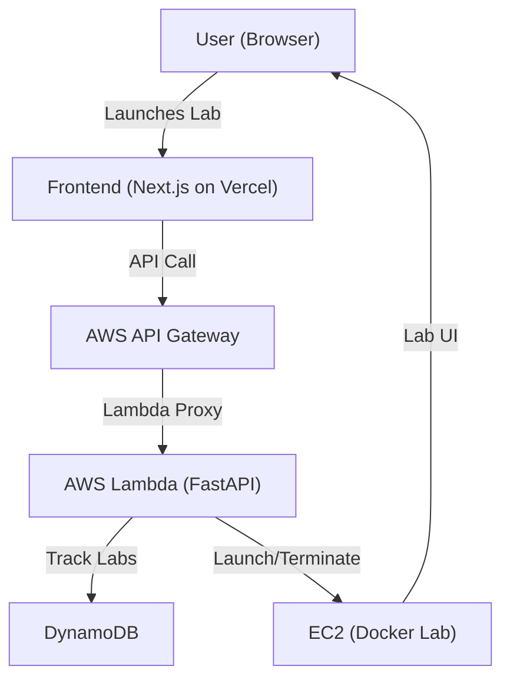

# LabStack

> **Spin up disposable, browser-based development labs in the cloud.**

---

## 🚀 What is LabStack?
LabStack is a cloud-native platform that lets you launch ephemeral, browser-accessible development environments ("labs") in seconds. Designed for speed, security, and developer delight, LabStack is perfect for onboarding, workshops, hackathons, and safe experimentation—no local setup, no cleanup required.

---

## ✨ Features
- **One-click Lab Launch:** Instantly spin up a fresh dev environment in your browser.
- **Disposable & Isolated:** Each lab runs in its own secure EC2 instance, terminated on demand.
- **Animated, Minimalist UI:** Modern, interactive landing page with animated lab cards, glitch effects, and ambient visuals.
- **Real-time Feedback:** Live status, progress indicators, and celebratory states (confetti, sound hooks).
- **Dynamic Storytelling:** Time-based taglines, real-time stats, and environmental storytelling.
- **Terminate Labs:** Instantly shut down labs to save costs and keep things tidy.
- **Easter Eggs & Personality:** Fun micro-interactions, cursor trails, and hidden surprises.

---

## 🏗️ Architecture



- **Frontend:** Next.js (Vercel) with advanced UI/UX, minimal dark theme, and premium typography (Inter, Poppins, Orbitron).
- **Backend:** FastAPI app, serverless via AWS Lambda (Mangum/Zappa), exposed through API Gateway.
- **Lab Orchestration:** EC2 instances launched per lab, running Docker containers for each lab type (configurable via JSON templates).
- **Persistence:** DynamoDB for lab tracking and status.
- **CI/CD:** GitHub Actions (optional), Vercel for frontend deploys.

---

## 🧑‍💻 User Flow
1. **Land:** User visits LabStack, greeted by animated, interactive landing page.
2. **Launch:** Clicks "Launch Lab"—progress, animation, and real-time feedback begin.
3. **Lab Ready:** User is redirected to a browser-based IDE/terminal (via EC2/Docker).
4. **Terminate:** User can terminate the lab at any time, instantly shutting down the EC2 instance.

---

## 🛠️ Tech Stack
- **Frontend:** Next.js, Tailwind CSS, Framer Motion, custom React components
- **Backend:** FastAPI, AWS Lambda (Mangum), API Gateway
- **Cloud:** AWS EC2, DynamoDB, Docker, GitHub Container Registry
- **Infra as Code:** (Optional) Terraform, AWS CDK
- **CI/CD:** GitHub Actions, Vercel

---

## 🧩 Lab Templates
Lab types are defined in a JSON file, specifying Docker images, ports, and container configs. Easily extendable for new stacks (Node, Python, Go, etc).

---

## 🛡️ Security & Cost
- **Ephemeral by Design:** Labs are short-lived, isolated, and auto-terminated.
- **No Persistent Data:** All work is wiped on termination—perfect for safe experimentation.
- **Cost Control:** Users can terminate labs at any time; backend enforces TTLs.

---

## 🌱 Why LabStack?
- **Zero Setup:** No local installs, no config, no risk to your machine.
- **Onboarding & Workshops:** Get everyone coding in seconds, not hours.
- **Safe Experimentation:** Try new stacks, break things, start over—no mess.
- **Recruiter-Friendly:** Show off your cloud, infra, and frontend chops in one project.

---

## 📈 Future Plans
- **OAuth & User Accounts**
- **Persistent Volumes (opt-in)**
- **Prebuilt Lab Templates (AI/ML, Web, Data, etc)**
- **Usage Analytics & Billing**
- **Team/Org Management**
- **Self-Destructing Labs (TTL)**

---

## 📝 Setup & Usage

### Frontend
```bash
pnpm install
pnpm dev
```

### Backend (see `aws-lambda-function/`)
- Deploy FastAPI app to AWS Lambda (Mangum/Zappa)
- Configure API Gateway, DynamoDB, EC2 permissions

---

## 🤝 Contributing
PRs welcome! Please open issues for bugs, ideas, or feature requests.

---

## 📄 License
MIT

---

> Minimal, beautiful, and powerful. LabStack is your cloud dev playground. 