# 🚀 LabStack

> **Spin up disposable, browser-based development labs in the cloud.**  
> Provisioned on AWS EC2, orchestrated via Lambda, served via Docker.  

📖 [Read the full blog on Hashnode](#https://labstack.hashnode.dev/building-labstack) <!-- replace with your actual Hashnode link -->

---

## 🧠 What is LabStack?

**LabStack** is a cloud-native DevOps playground that lets users launch isolated, time‑limited development environments (“labs”) entirely in the browser — ideal for workshops, onboarding, prototyping, or safe experimentation.

Built to demonstrate **cloud automation, Docker orchestration, and frontend UX**, it spins up prebuilt Docker environments on EC2 via a serverless backend, and automatically shuts them down after use.

---

## ✨ Core Features

- ⚡️ **One‑Click Lab Launch** – Interactive landing page triggers lab provisioning in seconds.  
- 🔒 **Isolated EC2 Labs** – Every lab runs in a dedicated EC2 instance with Dockerized tools.  
- 🎨 **Animated UI** – Glitch effects, ambient visuals, confetti hooks, and real‑time UX feedback.  
- ⏱ **Time‑To‑Live (TTL)** – Labs are auto‑terminated after expiry to reduce AWS costs.  
- 🧹 **Disposable by Design** – Labs wipe clean on shutdown; no persistent state or manual cleanup.

---

## 🏗️ Architecture Overview

```mermaid
graph TD;
  User["👩‍💻 User (Browser)"] -->|Launch Request| Vercel["🌐 Frontend (Next.js)"];
  Vercel -->|HTTP| APIGW["🛡 API Gateway"];
  APIGW -->|Proxy| Lambda["⚙️ Lambda Function (FastAPI)"];
  Lambda -->|Create/Track| DynamoDB["🧾 DynamoDB (Lab Metadata)"];
  Lambda -->|Launch Lab| EC2["🚀 EC2 Instance (Docker Lab)"];
  EC2 -->|Expose Lab UI| User;
```



---

## 🛠 Tech Stack

**Frontend**

* Next.js App Router (Vercel)
* Tailwind CSS + Framer Motion
* shadcn/ui + Radix primitives
* Custom Hooks: lab polling, toast feedback, redirect on ready

**Backend**

* FastAPI inside AWS Lambda (Mangum)
* AWS SDK & Docker SDK for instance/container orchestration
* DynamoDB for lab metadata & status
* GitHub Container Registry for hosting lab images

**Infra**

* AWS EC2 for isolated lab instances
* API Gateway → Lambda control plane
* DynamoDB state store
* (Optional) Terraform or CDK IaC

---

## 🧩 Lab Templates

Defined in `lab_templates.json`:

```json
{
  "labstack-python-lab": {
    "image": "ghcr.io/kamatanirudh/labstack-python-lab",
    "port": 8080,
    "container_port": 8080
  },
  "labstack-networking-lab": {
    "image": "ghcr.io/kamatanirudh/labstack-networking-lab",
    "port": 8081,
    "container_port": 8080
  }
}
```

* **image**: GHCR path
* **port**: public port on EC2
* **container_port**: Docker container port

---

## 📲 User Flow

1. **Landing Page**
   User visits the Next.js app on Vercel.
2. **Launch**
   Select a lab type & TTL → POST to `/labs` via API Gateway.
3. **Provision**
   Lambda reads `lab_templates.json`, spins up EC2 with user data to pull & run the Docker container, schedules shutdown.
4. **Redirect**
   Frontend polls `/labs/{id}/status` until ready, then redirects to `http://<EC2_IP>:<port>`.
5. **Terminate**
   User clicks “Terminate” or TTL expires → Lambda terminates the EC2 instance.

---

## 🔐 Security & Cost Controls

* **Stateless Labs**: No persistence beyond container lifetime.
* **Instance Isolation**: Separate EC2 per lab.
* **TTL Enforcement**: `shutdown -h +<ttl>` in user-data.
* **Manual Termination**: UI button to clean up immediately.

---

## 🧑‍💻 Developer Setup

### 🔧 Local Development

```bash
# Backend
cd labstack-backend
python3 -m venv venv && source venv/bin/activate
pip install -r requirements.txt
uvicorn main:app --reload

# Frontend
cd labstack-frontend
pnpm install
pnpm dev
```

### ☁️ Deployment

1. **Build & Publish Docker Images**

   ```bash
   docker build -t ghcr.io/kamatanirudh/labstack-python-lab ./python-lab
   docker push ghcr.io/kamatanirudh/labstack-python-lab
   docker build -t ghcr.io/kamatanirudh/labstack-networking-lab ./networking-lab
   docker push ghcr.io/kamatanirudh/labstack-networking-lab
   ```

2. **Deploy Backend to AWS Lambda**

   * Use Zappa, Serverless Framework, or Terraform/Mangum
   * Configure API Gateway, DynamoDB table, and IAM roles

3. **Deploy Frontend to Vercel**

   * Connect to GitHub repo
   * Set environment variables:

     * `NEXT_PUBLIC_API_URL`
     * AWS credentials/secrets in GitHub Actions or Vercel dashboard

---

## 📈 Future Roadmap

* [ ] OAuth (GitHub/Google login)
* [ ] Persistent volumes (opt‑in)
* [ ] Prebuilt AI/ML & web dev lab templates
* [ ] Usage analytics & billing dashboard
* [ ] WebSocket‑based launch feedback

---

## 📚 Project Structure

```
.
├── labstack-frontend/          # Next.js + Tailwind + shadcn/ui
│   ├── app/
│   ├── components/
│   ├── hooks/
│   └── public/
├── labstack-backend/           # FastAPI + Mangum for AWS Lambda
│   ├── aws-lambda-function/
│   │   ├── ec2_launcher.py
│   │   ├── terminate_lab.py
│   │   └── main.py
│   ├── lab_templates.json
│   └── requirements.txt
├── terraform/ (optional)       # IaC for AWS resources
└── README.md
```

> 💡 **LabStack** showcases end-to-end cloud orchestration, from frontend to serverless backend to containerized labs on EC2.
> Built for developers. Powered by AWS. Styled for delight. 
